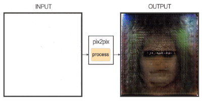
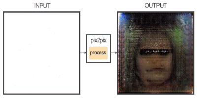

# face-generator

Based on [pix2pix](https://phillipi.github.io/pix2pix/) by Isola et al.

     \q      
Keras implementation of pix2pix and ICGAN(https://arxiv.org/abs/1611.06355).

## Setup


### Prerequisites
- Keras 2.2.0

### clone this repo
git clone https://github.com/tangji08/face-generator/ \
cd face-generator

### prepare the dataset (Celeba)
Put input sketches in folder "input/" \
Put output images in folder "output/" \
(if you want to train ICGAN, put label description in root path "label.txt")

### train the pix2pix model 
```sh
python train.py \
  --mode pix2pix \
  --input_dir input/ \
  --outnput_dir output/ \
  --max_epochs 10 \
  --summary_freq 1 \
  --sample_freq 50 \
  --sample_dir images/ \
  --save_freq 1000 \
  --batch_size 1 \
  --ngf 64 \
  --ndf 64 \
  --scale_size 256
```
  
### train the ICGAN model 
```sh
python train.py \
  --mode ICGAN \
  --input_dir input/ \
  --outnput_dir output/ \
  --label_dir 'label.txt' \
  --attributes 2 \
  --max_epochs 10 \
  --summary_freq 1 \
  --sample_freq 50 \
  --sample_dir images/ \
  --save_freq 1000 \
  --batch_size 1 \
  --ngf 64 \
  --ndf 64 \
  --scale_size 256
```

